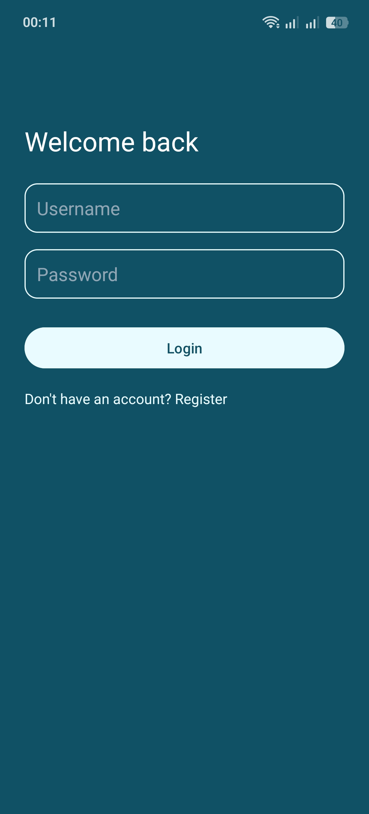
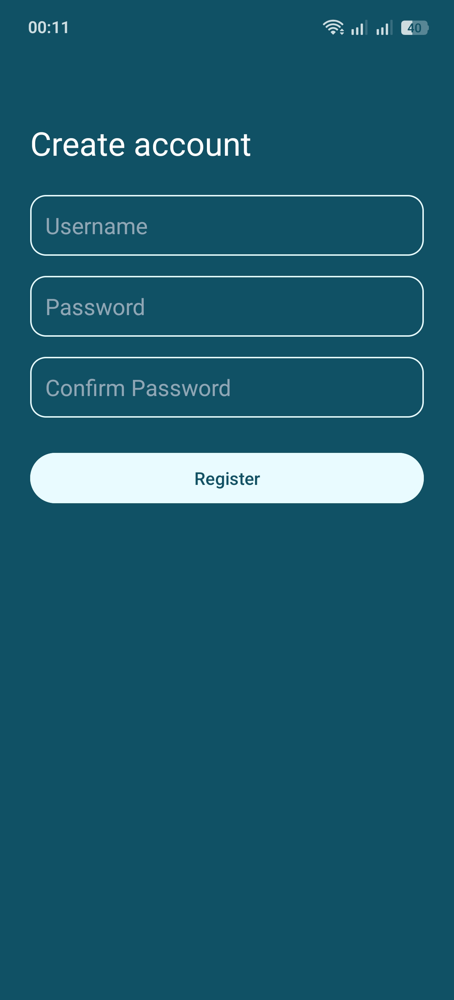
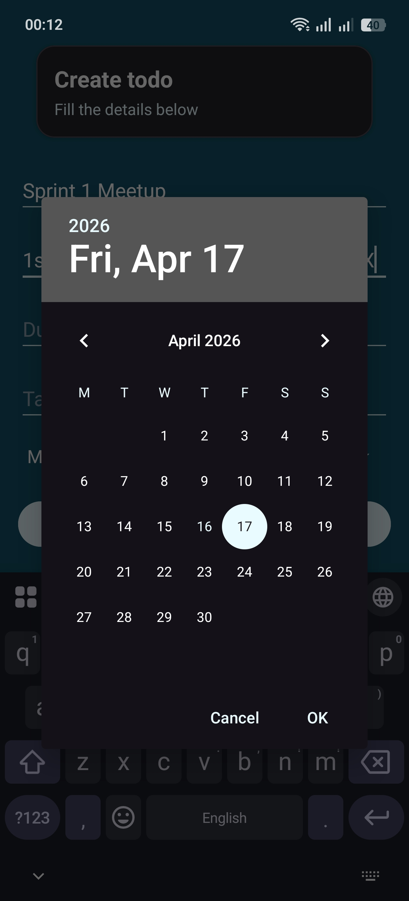
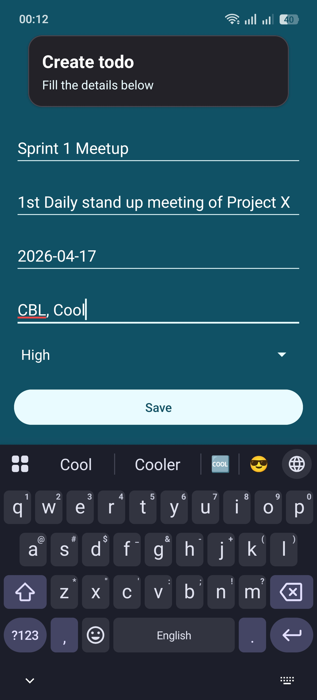
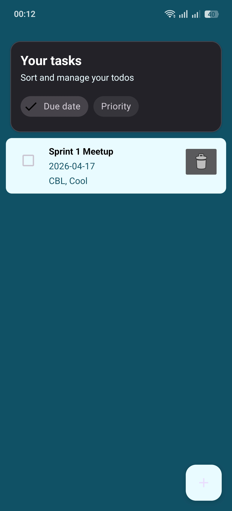

# To-Do App

A compact, offline-first Android To‑Do application with local user accounts, built with a clean MVVM-style architecture. This repository is intended as a job-assessment project and demonstrates practical Android engineering patterns, testability, and clean separation of concerns.

---

## Table of contents

- [Key highlights](#key-highlights)
- [Technical summary](#technical-summary)
- [Architecture & project structure](#architecture--project-structure)
- [Getting started](#getting-started)
- [Build & run](#build--run)
- [Testing](#testing)
- [Security & data handling](#security--data-handling)
- [Notes for reviewers](#notes-for-reviewers)
- [License](#license)

---

## Key highlights

- Local user accounts with secure password hashing (no external backend required)
- Per-user persistent to‑do lists using Room (offline-first)
- MVVM separation: `presentation`, `domain`, `data` layers with simple DI helpers
- Sorting by due date and priority; add/edit/delete tasks; haptic feedback and light animations
- Modern AndroidX libraries: LiveData, ViewModel, RecyclerView, Material Components

## Screenshots

Below are representative screenshots from the running app (files located in the `screenshots/` folder).

- Main screen  
  

- Add / Edit task  
  

- Login screen  
  

- Settings / filters  
  

- Empty / list state  
  

## Technical summary

- Language: Java (Android app)
- Build system: Gradle (Kotlin DSL)
- Android SDK: compileSdk = 36, targetSdk = 36, minSdk = 33
- Java compatibility: Java 11
- Persistence: Room database
- Notable libraries: AndroidX, Material Components, Room, Timber (logging), jBCrypt (password hashing)

## Architecture & project structure

The project follows a lightweight MVVM pattern with a domain/use-case layer.

- `app/src/main/java/com/example/todo`
  - `data/` — local data sources (Room entities, DAOs, repository implementations)
  - `domain/` — business models and use‑cases (interactors)
  - `presentation/` — Activities, ViewModels, Adapters and UI logic
  - `di/` — simple provider modules (`AppModule`, `RepositoryModule`, `DatabaseModule`)
  - `utils/` — constants and helpers

Entry points:

- Application: `BaseApplication` (follows system dark/light mode)
- Main screens: `MainActivity`, `AddEditTodoActivity`, `LoginActivity`, `RegisterActivity`

Refer to the package source at `app/src/main/java/com/example/todo` for implementation details.

## Getting started

Prerequisites

- Android Studio (or CLI with Android SDK installed)
- Android SDK platform for API 36
- Java 11

Clone the repository

```bash
git clone <your-repo-url>.git
cd ToDoApp
```

Open the project

- Open the project in Android Studio and allow Gradle to sync and download dependencies.

## Build & run

From Android Studio

1. Select the `app` module.
2. Run on an emulator or connected device.

From the command line

```bash
./gradlew assembleDebug
./gradlew installDebug   # installs on a connected device/emulator
```

Debug APKs are generated under:

- `app/build/outputs/apk/debug/`

Release build

Build a release APK (note: signing configuration required for distribution):

```bash
./gradlew assembleRelease
```

Release APK location:

- `app/build/outputs/apk/release/app-release.apk`

## Testing

Unit tests and instrumentation tests (if present) can be executed with Gradle:

```bash
./gradlew test                 # unit tests
./gradlew connectedAndroidTest # instrumentation tests (requires device/emulator)
```

## Security & data handling

- Passwords are hashed using `jBCrypt` before storage.
- All data is stored locally in a Room database; there are no network calls by default.
- The database is namespaced per user (each todo has an `ownerUsername` field).

## Notes for reviewers

- Clean separation: business logic is contained in `domain.usecase` classes and exposed via ViewModels.
- Lightweight DI: the project uses static provider modules (`AppModule`, `RepositoryModule`) so dependencies are explicit and easy to follow.
- Room DAOs and entities live under `data.local` and map directly to the domain models.
- UI: `MainActivity` demonstrates a typical list screen with sorting chips, a RecyclerView using `TodoAdapter`, and an activity-based Add/Edit flow.

If you want further improvements or explanations I can:

- Add unit/instrumentation tests where missing
- Provide a short video or screenshots demonstrating the app
- Convert DI to Dagger/Hilt for larger-scale projects

## License

This project is provided for assessment and demonstration purposes. Add a license file if you intend to publish or reuse the code.

---

If you'd like, I can also:

- add a CONTRIBUTING section, or
- generate a short summary document you can attach to your job submission.

